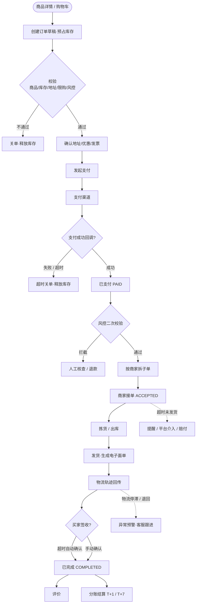
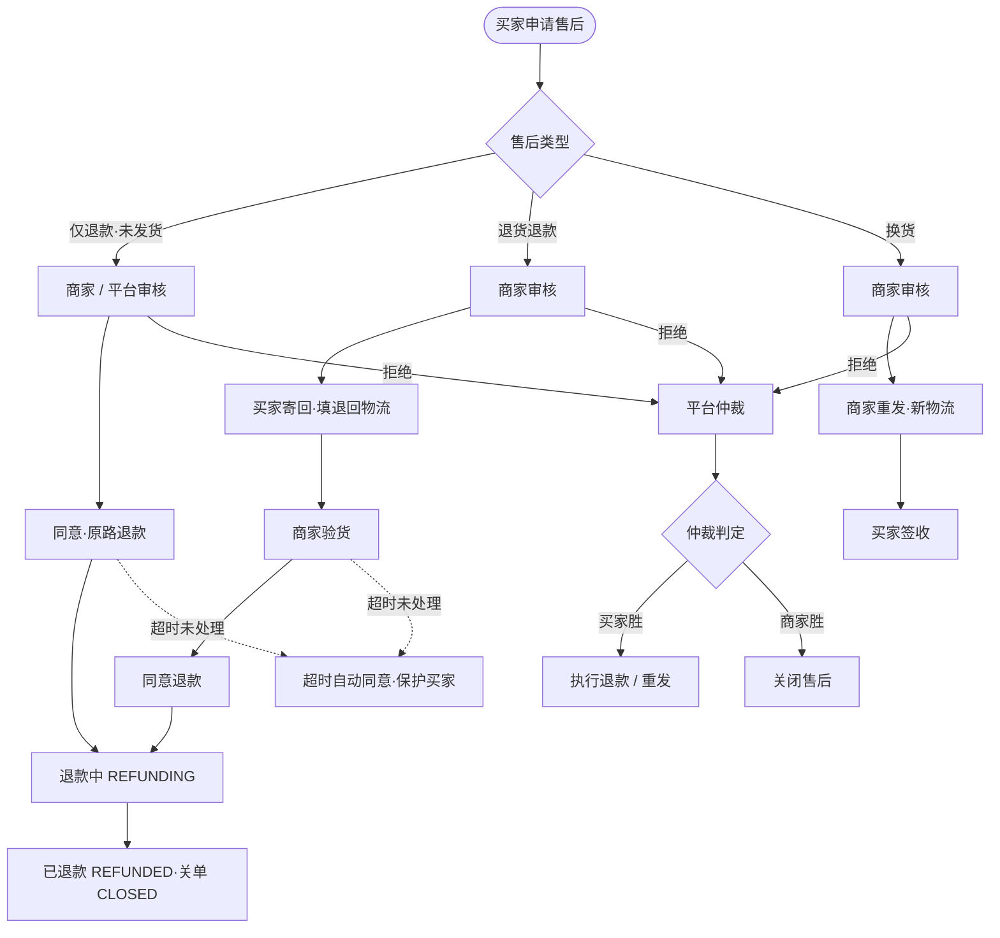

# 电商订单完整链路图（Mermaid）

> 覆盖：正向交易主流程 + 异常分支 + 逆向售后全类型
> 适用：B2C / C2C 综合电商订单管理系统 PRD

## 图 1：交易主链路 + 异常分支

```mermaid
flowchart TD
    A([商品详情 / 购物车]) --> B[创建订单草稿·预占库存]
    B --> C{校验<br/>商品/库存/地址/限购/风控}
    C -- 不通过 --> X1[关单·释放库存]
    C -- 通过 --> D[确认地址/优惠/发票]
    D --> E[发起支付]
    E --> F[支付渠道]
    F --> G{支付成功回调?}
    G -- 失败 / 超时 --> X2[超时关单·释放库存]
    G -- 成功 --> H[已支付 PAID]
    H --> I{风控二次校验}
    I -- 拦截 --> X3[人工核查 / 退款]
    I -- 通过 --> J[按商家拆子单]
    J --> K[商家接单 ACCEPTED]
    K --> L[拣货 / 出库]
    L --> M[发货·生成电子面单]
    M --> N[物流轨迹回传]
    N --> O{买家签收?}
    O -- 超时自动确认 --> P[已完成 COMPLETED]
    O -- 手动确认 --> P
    P --> Q[评价]
    P --> R[分账结算 T+1 / T+7]

    K -. 超时未发货 .-> W1[提醒 / 平台介入 / 赔付]
    N -. 物流停滞 / 退回 .-> W2[异常预警·客服跟进]
```

## 图 2：逆向售后链路（全类型）

```mermaid
flowchart TD
    S0([买家申请售后]) --> S1{售后类型}
    S1 -- 仅退款·未发货 --> S2[商家 / 平台审核]
    S1 -- 退货退款 --> S3[商家审核]
    S1 -- 换货 --> S4[商家审核]

    S2 --> S2a[同意·原路退款]
    S2a --> S2b[退款中 REFUNDING]
    S2b --> S2c[已退款 REFUNDED·关单 CLOSED]

    S3 --> S3a[买家寄回·填退回物流]
    S3a --> S3b[商家验货]
    S3b --> S3c[同意退款]
    S3c --> S2b

    S4 --> S4a[商家重发·新物流]
    S4a --> S4b[买家签收]

    S2 -- 拒绝 --> S5[平台仲裁]
    S3 -- 拒绝 --> S5
    S4 -- 拒绝 --> S5
    S5 --> S6{仲裁判定}
    S6 -- 买家胜 --> S6a[执行退款 / 重发]
    S6 -- 商家胜 --> S6b[关闭售后]

    S2a -. 超时未处理 .-> S7[超时自动同意·保护买家]
    S3b -. 超时未处理 .-> S7
```
